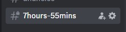
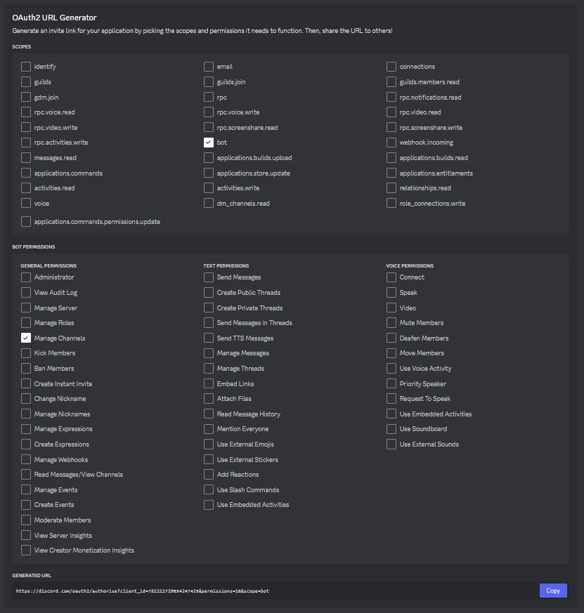

# DISCORD COUNTDOWN CHANNEL RENAME

The project involves the development of a Discord bot designed to facilitate countdowns by automatically renaming a designated Discord channel every 5 minutes. This bot aims to provide a seamless experience for users wishing to create countdowns for various events or occasions within their Discord server.

It is built upon [node.js](https://nodejs.org/) and [discord.js](https://discord.js.org/).



## 🚧 | Prerequisites
- [Node.js >= 20](https://nodejs.org/en/download/)
> or
- [yarn](https://classic.yarnpkg.com/lang/en/docs/install/#windows-stable)
## 📝 | Installation

> First of all you need to create a discord bot on [Discord developer portal](https://discord.com/developers), generate a bot token and invite it with the following permissions:



- **Install requirements**
    ```bash
    yarn
    ```
    > or  
    ```bash
    npm install
    ```
    > This command installs the required dependencies.

- **Configuration**
    - Rename ".env_example" to ".env"
    - Environment variables:
    ```plaintext
    TOKEN=              // DISCORD BOT TOKEN
    CHANNEL_ID=         // CHANNEL ID TO RENAME
    COUNTDOWN=          // DATE ON WHICH THE COUNTDOWN ENDS IN TIMESTAMP - EXAMPLE: 1712786400 - EXAMPLE OF GENERATE ONE: https://timestampgenerator.com
    TIMEZONE=           // TIMEZONE OF THE COUNTDOWN - EXAMPLE: +2
    FORMAT=             // HOW TO FORMAT THE COUNTDOWN - EXAMPLE: ${H}hours-${M}mins - AVALIABLE VARIABLES: ${Y} ${D} ${H} ${M} ${S} - YEARS DAYS HOURS MIN SEG
    ```
    > **TOKEN**: This is the Discord bot token you need to authenticate and access the Discord API. You should obtain this token by registering your bot on the Discord Developer Portal.

    > **CHANNEL_ID**: This is the ID of the Discord channel you want to rename. You need to have sufficient permissions on the Discord server to perform this action.

    > **COUNTDOWN**: This variable represents the date and time when the countdown ends, expressed as a timestamp. You can generate this timestamp using online tools like the provided link.

    > **TIMEZONE**: Here you define the timezone in which the countdown is located. This is important for correctly calculating the remaining time. For example, you can use "+2" if the countdown is in a timezone with GMT+2.

    > **FORMAT**: This is the format string that specifies how you want the countdown to be displayed. You can customize this using the provided variables such as years (${Y}), days (${D}), hours (${H}), minutes (${M}), and seconds (${S}). For example, ${H}hours-${M}mins will display the remaining hours followed by the remaining minutes.

- **Start bot**

    ```bash
    yarn start
    ```
    > or
    ```bash
    npm start
    ```

- **Development bot**

    ```bash
    yarn dev
    ```
    > or
    ```bash
    npm dev
    ```